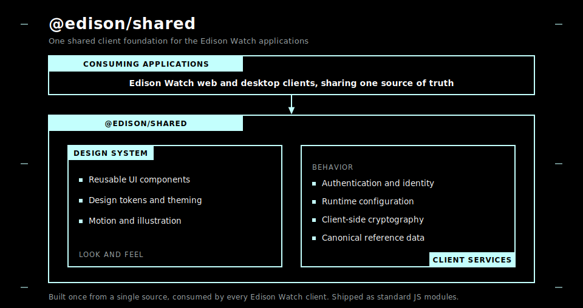

# @edison/shared

[](https://github.com/Edison-Watch/shared/actions/workflows/ci.yaml)
[](https://codecov.io/gh/Edison-Watch/shared)
[](LICENSE)
[](package.json)

**Shared React components, design tokens, and client-side utilities for Edison Watch.**

<a href="#what-is-this">What is this</a> •
<a href="#quick-start">Quick start</a> •
<a href="#package-entrypoints">Entrypoints</a> •
<a href="#modules">Modules</a> •
<a href="#configuration-scope">Configuration</a> •
<a href="#architecture">Architecture</a> •
<a href="#contributing">Contributing</a> •
<a href="#license">License</a>

## What is this

- React UI components and Edison design tokens
- Product and security animations used in the Edison Watch clients
- Agent registry data and SVG assets
- Browser-side authentication, configuration, and crypto utilities

This repository is public so that the shared client code used across Edison Watch can be audited and evaluated. It is intentionally an Edison Watch package, not a generic component library or a hosted service SDK.

<p align="center">
  
</p>

> [!NOTE]
> `@edison/shared` is at `0.1.0` and is not published to npm. Edison Watch repositories consume it from source, including through Git submodules. Module subpaths and build output are kept stable so publishing can change without redesigning the public surface. Only values safe to expose in browser bundles belong here: no server credentials, private keys, or privileged tokens.

## Quick start

TLDR: `npm ci && npm run build`

Requires Node.js 22 or later (CI also runs on Node 24) and npm.

```bash
npm ci          # install dependencies
npm run typecheck
npm run test
npm run build   # emits ESM, CJS, and .d.ts to dist/
```

<details>
<summary>More commands</summary>

```bash
npm run lint           # eslint
npm run format:check   # prettier (use `npm run format` to write)
npm run knip           # unused exports / dependencies
npm run test:coverage  # vitest with v8 coverage
npm run storybook      # component explorer on :6006
npm run build-storybook
```

</details>

Consumers of the UI and auth modules must provide the declared peer dependencies: React, React DOM, React Router, and Supabase JS.

## Package entrypoints

TLDR: import the subpath you need; see [`package.json`](package.json) `exports` for the full list.

<details>
<summary>Entrypoints</summary>

Each entrypoint is independently tree-shakeable.

| Entrypoint | Contents |
|------------|----------|
| `@edison/shared` | Root barrel re-exporting the public surface |
| `@edison/shared/ui` and `@edison/shared/ui/*` | React UI components |
| `@edison/shared/hooks/*` | React hooks |
| `@edison/shared/theme/tokens.css` | Edison design tokens (CSS custom properties) |
| `@edison/shared/animations` | Product and security SVG animations |
| `@edison/shared/svg` | SVG asset path/string exports |
| `@edison/shared/auth` | Browser auth and Supabase client |
| `@edison/shared/config` | Client/runtime environment configuration |
| `@edison/shared/crypto` | Client-side crypto utilities |
| `@edison/shared/agent-registry` | Canonical agent icon and metadata registry |

</details>

## Modules

TLDR: a design-system half and a client-services half; browse [`src/`](src) for the source.

<details>
<summary>What lives where</summary>

- **UI components** ([`src/ui/`](src/ui)): Badge, Button, Card, Dialog, Dropdown, EmptyState, ErrorBoundary, Input, Select, Skeleton, SlideOver, SSEIndicator, Switch, Table, Tabs, Toast, and Tooltip. Each ships a matching `*.stories.tsx`.
- **Design tokens** ([`src/theme/tokens.css`](src/theme/tokens.css)): theme color, spacing, and typography custom properties shared across clients.
- **Hooks** ([`src/hooks/`](src/hooks)): small React utilities such as `useAnimatedHeight`.
- **Animations** ([`src/animations/`](src/animations)): self-contained SVG + CSS-keyframe animations for product and threat explainers. See [`src/animations/CLAUDE.md`](src/animations/CLAUDE.md) for the design language and copywriting conventions.
- **SVG assets** ([`src/svg/`](src/svg)): logo, app-icon, and connector SVG path data.
- **Auth** ([`src/auth/`](src/auth)): browser-side authentication and the shared Supabase client.
- **Config** ([`src/config/`](src/config)): runtime environment configuration with demo/release/local switching.
- **Crypto** ([`src/crypto/`](src/crypto)): client-side encryption and secret-key API helpers.
- **Agent registry** ([`src/agent-registry/`](src/agent-registry)): display names, brand colors, and icon data for supported coding agents.

</details>

## Configuration scope

The client configuration in [`src/config/env-config.ts`](src/config/env-config.ts) intentionally contains Edison Watch service endpoints and browser-facing values. This keeps client behavior auditable and supports the apps that consume the package. Both `demo` and `release` configs are baked into the bundle at build time, and a `local` config resolves against the page origin for the fully-offline stack.

```ts
export interface EnvConfig {
  SUPABASE_URL: string             // GoTrue / Supabase auth origin (supabase-js base URL)
  SUPABASE_ANON_KEY: string        // Publishable anon key (safe in client bundles)
  FUNCTIONS_URL: string            // Base URL for Supabase edge functions
  SENTRY_DSN: string               // Error reporting DSN
  POSTHOG_API_KEY: string          // Product analytics key
  POSTHOG_FEEDBACK_SURVEY_ID: string
  DEPLOY_ENV: string               // "demo" | "release" | "local"
  API_BASE_URL: string             // Default API server base URL
  MCP_BASE_URL: string             // Default MCP server base URL
  RELEASES_BASE_URL: string        // Desktop release bucket (electron-updater feed)
}
```

Only values that are safe to expose in browser applications belong in this repository. Do not add server credentials, private keys, privileged API tokens, or other secrets.

## Architecture

The SVG above is the at-a-glance view. The text diagram below renders everywhere and captures the same durable shape: two capability domains shared by every client, sitting on a host-provided runtime.

<details>
<summary>Conceptual layout</summary>

```
   Edison Watch applications (web / desktop clients)
                          │  share one source of truth
                          ▼
   ┌──────────────────── @edison/shared ────────────────────┐
   │                                                         │
   │   Design system                Client services          │
   │   (look and feel)              (behavior)                │
   │   ├─ Reusable UI components    ├─ Authentication         │
   │   ├─ Design tokens & theming   ├─ Runtime configuration  │
   │   └─ Motion & illustration     ├─ Client-side crypto     │
   │                                └─ Canonical reference    │
   │                                                         │
   └────────────────────────────┬────────────────────────────┘
                                 │  shipped as standard JS modules
                                 ▼
        Host runtime (provided by the consuming app):
        React UI runtime · application data & auth platform
```

</details>

## Visual regression tests

TLDR: `npm run build-storybook && npm run test:visual`

<details>
<summary>Updating baselines</summary>

Visual tests run manually when UI changes warrant them. After intentional visual changes, update and commit the baselines:

```bash
npm run test:visual:update
```

Baselines live in [`visual-tests/`](visual-tests). The build is verified in CI (typecheck, lint, format, knip, coverage, build, and Storybook build) on Node 22 and Node 24.

</details>

## Contributing

Issues and focused contributions are welcome. Please open an issue with a clear description, expected behavior, and a minimal reproduction where possible. Broader organization-level contribution and security policies will be published separately.

Two repository conventions worth noting before you open a PR:

- **Plain prose only.** CI runs [`scripts/check-ai-writing.ts`](scripts/check-ai-writing.ts), which rejects em dashes (U+2014) and contrastive parallelism. Use hyphens and direct phrasing.
- **Folder and file size limits** are enforced by [`scripts/check_folder_sizes.sh`](scripts/check_folder_sizes.sh) and [`scripts/check_large_files.sh`](scripts/check_large_files.sh).

## Credits

This package is built with:

- [React](https://react.dev) and [React Router](https://reactrouter.com)
- [tsdown](https://tsdown.dev) for bundling to ESM/CJS/types
- [Storybook](https://storybook.js.org) for component development
- [Vitest](https://vitest.dev) and [Playwright](https://playwright.dev) for unit and visual tests
- [Supabase JS](https://supabase.com/docs/reference/javascript) for auth
- [simple-icons](https://simpleicons.org) for agent icon paths

## About the contributors

<a href="https://github.com/Edison-Watch/shared/graphs/contributors">
  
</a>

Made with [contrib.rocks](https://contrib.rocks).

## License

This project is licensed under the [GNU Affero General Public License v3.0 only](LICENSE).
